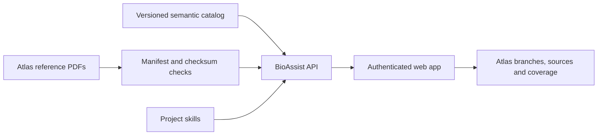

# BioAssist

BioAssist is a health operating system in active build: document + device ingestion, longitudinal timeline normalization, and evidence-linked recommendation planning.

## Find your way

| Area | Current behavior | Guide |
| --- | --- | --- |
| Web app | Auth, onboarding, Home and interactive Health Atlas | [Web source](apps/web/src) |
| API | Auth, Home snapshot, Atlas catalog and source checksums | [API source](apps/api/src) |
| Atlas | 19 reference volumes; deep and taxonomy-only coverage are distinguished | [Catalog](docs/atlas/catalog.json) |
| Implementation | Shipped slice, proposed services and measurement boundaries | [Atlas blueprint](docs/ATLAS_IMPLEMENTATION_BLUEPRINT.md) |
| Project capabilities | Source curation, ingestion, measurement quality and evidence review | [Skills](skills) |
| Next work | Product and validation priorities | [Roadmap](ROADMAP.md) |



The current Atlas is a reference and discovery interface. Planned patient-data
pipelines and clinical validation are described separately in the blueprint.

## Local development

```bash
npm install
npm run dev
```

- Web: `http://localhost:5173`
- API: `http://localhost:4000`

## Docker compose

```bash
docker compose up -d --build
```

- Web: `http://localhost:15173`
- API health: `http://localhost:14000/api/health`

## Test commands

```bash
npm run test:api
npm run test:web
npm run test
```
